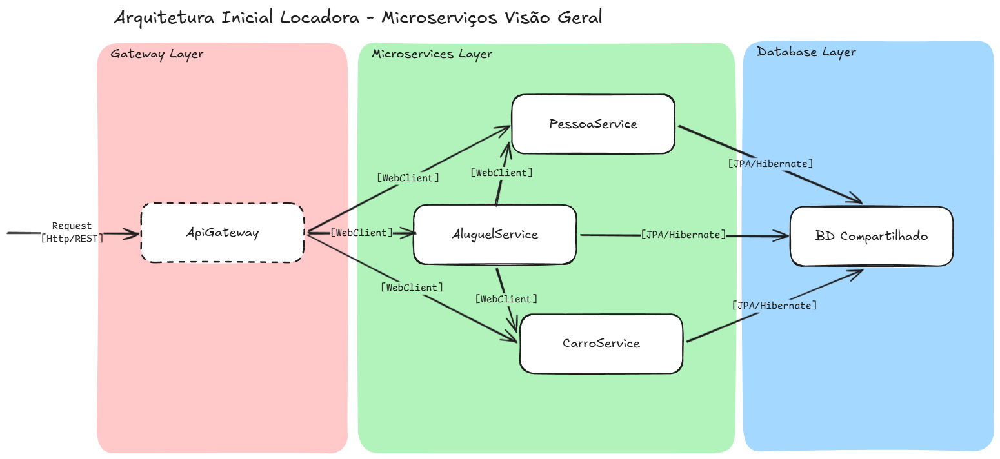

# ADR-001 – Divisão da aplicação em três microserviços

## Status
Aceita

## Contexto
Durante a modelagem inicial do domínio, foi considerada a criação de um microserviço para cada classe do diagrama. No entanto, essa abordagem geraria granularidade excessiva, aumentando a complexidade de comunicação e dificultando o desenvolvimento, sem ganhos relevantes para as regras de negócio.

Buscou-se uma divisão que mantivesse o conceito de serviços independentes, mas com fronteiras alinhadas ao domínio e ao aprendizado esperado.

## Decisão
A aplicação será disponibilizada em três microserviços principais:

- **Pessoa**: responsável pelas entidades Pessoa, Motorista e Funcionário.
- **Carro**: responsável pelo cadastro de veículos e controle de disponibilidade.
- **Aluguel**: responsável pelo processo de locação, atuando como orquestrador das interações entre Pessoa e Carro.

O microserviço de Aluguel será o único autorizado a se comunicar com os demais serviços. A comunicação entre microserviços será realizada via REST.

Será adotado um **API Gateway** como ponto de entrada da aplicação. Inicialmente, seu uso não será obrigatório, permitindo o acesso direto aos microserviços durante a fase inicial do projeto. À medida que o projeto evoluir e a arquitetura estiver mais consistente, a API Gateway deverá se tornar o único ponto de acesso externo.

Inicialmente, os microserviços compartilharão o mesmo banco de dados, sem duplicação de informações.

## Consequências
- Melhor organização do domínio, com serviços alinhados às regras de negócio.
- Redução da complexidade em comparação com um microserviço por classe.
- Centralização da lógica de orquestração no serviço de Aluguel.
- Manutenção do conceito de microserviços para fins educacionais, mesmo com banco de dados compartilhado.
- Introdução gradual da API Gateway, evitando complexidade excessiva no início.
- Possível acoplamento estrutural devido ao compartilhamento de banco, aceitável no contexto do treinamento.