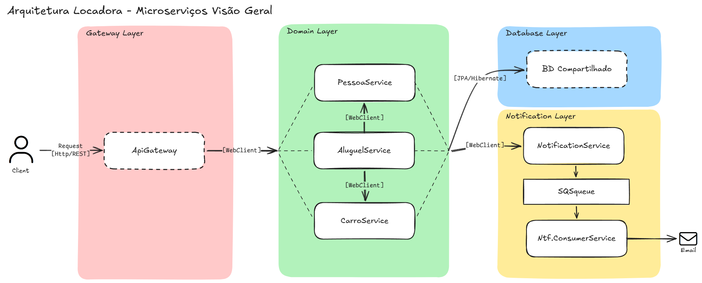

# ADR-004 – Implementação da camada de notificação assíncrona

## Status
Aceita

## Contexto
O projeto de locadora de veículos passou a exigir o uso de tecnologias de mensageria como parte do treinamento. Inicialmente, foi considerada a implementação de notificações de forma acoplada aos serviços de domínio.

Essa abordagem, no entanto, elevaria o nível de responsabilidade dos serviços de domínio, exigindo que eles conhecessem detalhes de configuração de fila, mensageria, formatação de mensagens e integração com mecanismos de envio de e-mail. Além disso, haveria risco de duplicação de código e maior acoplamento técnico.

Para alinhar a arquitetura a práticas reais de mercado, reduzir responsabilidades do domínio e introduzir mensageria de forma organizada, optou-se por criar uma **camada dedicada de notificação**.

## Decisão
Foi definida a criação de uma **Notification Layer**, composta por dois microserviços e uma fila intermediária:

- **notification-service**
  - Responsável por receber solicitações de notificação dos serviços de domínio via REST (WebClient reativo).
  - Centraliza a lógica de criação, validação e publicação de mensagens.
  - Atua exclusivamente como **publisher/sender** de mensagens.
  - Não acessa banco de dados nem contém regras de negócio do domínio.

- **Fila SQS**
  - Utilizada como mecanismo de desacoplamento assíncrono.
  - Implementada localmente com **LocalStack**, conforme o escopo do projeto.
  - Responsável por armazenar mensagens até que sejam processadas.

- **notification-consumer-service**
  - Responsável por consumir mensagens da fila em intervalos definidos.
  - Realiza o envio de e-mails com base nas mensagens recebidas.
  - Opera de forma independente do recebimento de novas mensagens.
  - O envio de e-mail é simulado utilizando **Mailpit**.

Todos os serviços de domínio podem solicitar o envio de notificações. A comunicação entre domínio e notification-service é síncrona, porém falhas no envio de notificações **não devem impactar o fluxo principal do domínio**, que deve prosseguir normalmente.

A escolha da fila SQS foi definida por exigência do treinamento e alinhamento com o ecossistema AWS. O LocalStack é utilizado para evitar dependência de infraestrutura de produção.

## Consequências
- Desacoplamento claro entre domínio e lógica de notificação.
- Centralização da configuração e da lógica de mensageria.
- Redução de responsabilidade dos serviços de domínio.
- Introdução de processamento assíncrono sem impacto no fluxo principal.
- Aumento da complexidade arquitetural e do número de serviços.
- Arquitetura preparada para evolução futura (ex.: novos tipos de notificação), sem comprometer o domínio.